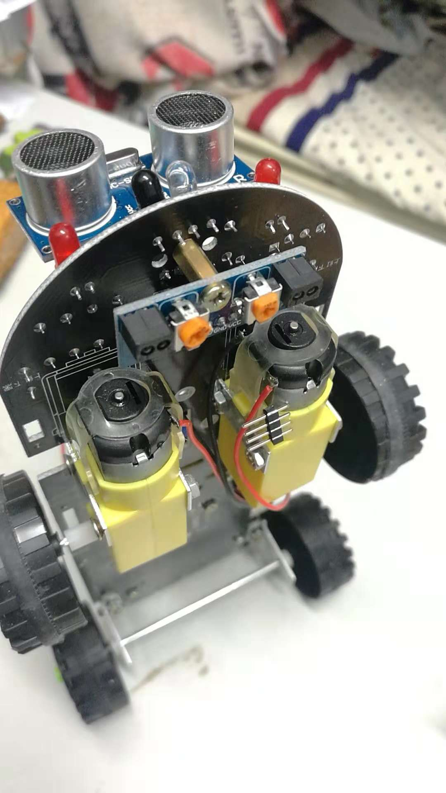
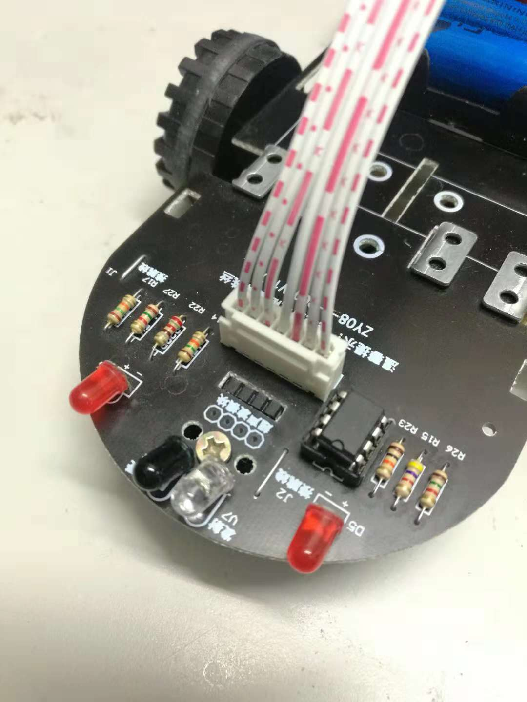
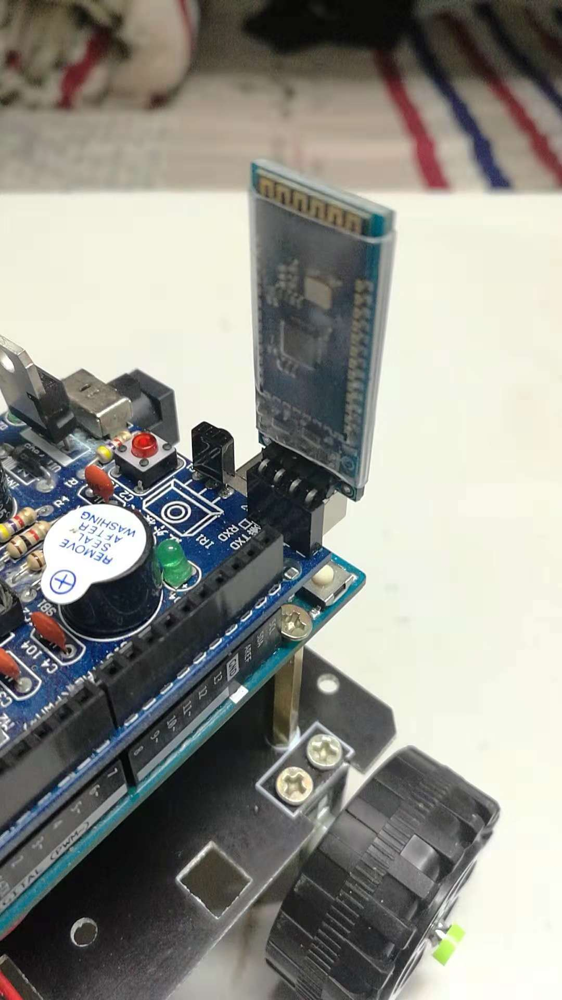
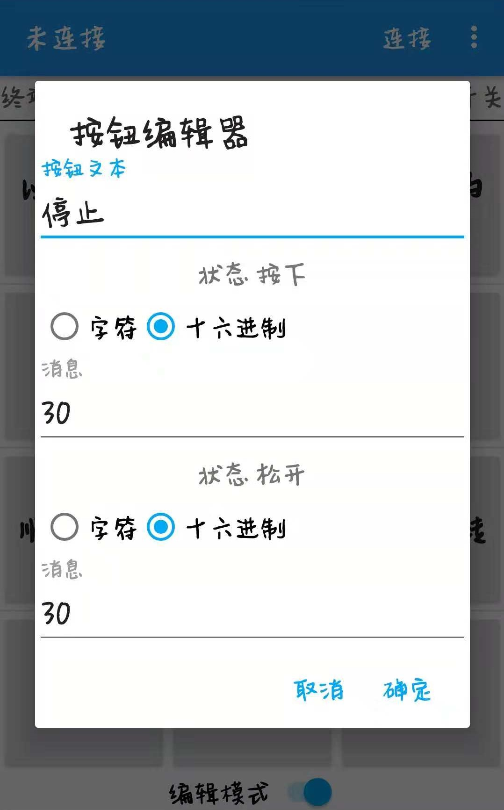

# AI-Car

An AI-Car based on deep learning and Arduino
# Project 1 - Random Walker

[AI-Car/Project1](https://github.com/jaingmengmeng/AI-Car/tree/master/Project1)

# Project 2 - Sensored Walker

<p align="center">
    
</p>

## 1. Infrared Following Track

<p align="center">
    
</p>


```C++
void loop()
{
    keysacn(); //调用按键扫描函数，当按键没被按下时处于忙等待状态；当按键被按下时，跳出死循环开始红外循迹。
    while (1)
    {   // 检测到黑线输出高，信号为HIGH，小车底部同侧LED灯亮；检测到白色区域输出低，信号为LOW，同侧灯灭
        SR = digitalRead(SensorRight);
        SL = digitalRead(SensorLeft);
        if (SL == LOW && SR == LOW)
            run();                       
        else if (SL == HIGH & SR == LOW)
        // 左循迹红外传感器输出高，检测到黑色区域，车子向右偏离轨道，此时应该向左转
            left();
        else if (SR == HIGH & SL == LOW)
        // 右循迹红外传感器输出高，检测到黑色区域，车子向左偏离轨道，此时应该向右转
            right();
        else// 左右循迹红外传感器都输出高，车子处在黑色区域内，小车停止
            brake();
    }
}
```


## 2. Infrared Avoid Obstacles

<p align="center">
    
</p>


```C++
void loop()
{
    keysacn(); //调用按键扫描函数，当按键没被按下时处于忙等待状态；当按键被按下时，跳出死循环开始红外避障。
    while (1)
    {
        //读取中间的红外避障传感器的状态。有信号为LOW，表示前方有障碍物；没有信号为HIGH，表示前方没有障碍物。
        S_avoid = digitalRead(Sensor_avoid);
        if (S_avoid == HIGH)
        //前面没有障碍物
        {
            run();                   //调用前进函数
            digitalWrite(beep, LOW); //蜂鸣器不响
            digitalWrite(LED, LOW);  //LED灯不亮
        }
        else if (S_avoid == LOW)
        // 前面探测到有障碍物，有信号返回
        {
            digitalWrite(beep, HIGH); //蜂鸣器响
            digitalWrite(LED, HIGH);  //LED亮
            brake(3);                 //停止300ms
            back(4);                  //后退400ms
            left(5);                  //调用左转函数  延时500ms
        }
    }
}
```


## 3. Ultrasonic Avoid Obstacles

<p align="center">
    
</pr>


```C++
float Distance_test() // 测量小车前方最近障碍物的距离
{
    digitalWrite(Trig, LOW); // 给触发脚低电平2μs
    delayMicroseconds(2);
    digitalWrite(Trig, HIGH); // 给触发脚高电平10μs
    delayMicroseconds(10);
    digitalWrite(Trig, LOW);  // 持续给触发脚低电
    float Total_time = pulseIn(Echo, HIGH);     // 读取回声脚接收到高电平的总时间(单位：微秒)。
    float Actual_distance = Total_time / 58;    // 计算实际障碍物的距离（单位：厘米）。
    Serial.print("Distance:");       //输出距离（单位：厘米）。
    Serial.print(Actual_distance);   //显示距离（单位：厘米）。
    return Actual_distance;
}

void loop()
{
    keysacn(); //调用按键扫描函数，当按键没被按下时处于忙等待状态；当按键被按下时，跳出死循环开始超声波避障。
    while (1)
    {
        Distance = Distance_test(); //调用测距函数测量前方最近障碍物的距离
        if (Distance < 10)          //当前方的障碍物的距离小于某个阈值时，开始后退并向右转一个角度
        {
            back(2);
            right(1);                 //右转
            digitalWrite(beep, HIGH); //蜂鸣器响起
            brake(1);                 //停车
        }
        else
        {
            run(); //无障碍物，直行
            digitalWrite(beep, LOW);
        }
    }
}
```


## 4. Bluetooth Telecontrol

<p align="center">
    
</p>


```C++
#define STOP 48             //30h       // 0  0
#define FORWARD 49          //31h       // 1  1
#define BACKWARD 50         //32h       //-1 -1
#define TURNLEFT 51         //33h       // 0  1
#define TURNRIGHT 52        //34h       // 1  0
#define ROTATELEFT 53       //35h       // 0 -1
#define ROTATERIGHT 54      //36h       //-1  0
#define SPINCLOCK 55        //37h       // 1 -1
#define SPINCOUNTERCLOCK 56 //38h       //-1  1

const int LeftMotorBack = 8;
const int LeftMotorGo = 9;
const int RightMotorGo = 10;
const int RightMotorBack = 11;

void setup()
{
    // put your setup code here, to run once:
    Serial.begin(9600);
    pinMode(LeftMotorGo, OUTPUT);
    pinMode(LeftMotorBack, OUTPUT);
    pinMode(RightMotorGo, OUTPUT);
    pinMode(RightMotorBack, OUTPUT);
}

void loop()
{
    // put your main code here, to run repeatedly:
    //usart read
    if (Serial.available() > 0)
    {
        int cmd = Serial.read(); //读取蓝牙模块发送到串口的数据
        Serial.println(cmd);
        motorRun(cmd);
    }
}

void motorRun(int cmd)
{
    switch (cmd)
    {
    case FORWARD:
        //1 1 左轮和右轮都前进
        Serial.println("FORWARD"); //输出状态
        digitalWrite(LeftMotorGo, HIGH);
        digitalWrite(LeftMotorBack, LOW);
        digitalWrite(RightMotorGo, HIGH);
        digitalWrite(RightMotorBack, LOW);
        break;
    case BACKWARD:
        //-1 -1 左轮和右轮都后退
        Serial.println("BACKWARD"); //输出状态
        digitalWrite(LeftMotorGo, LOW);
        digitalWrite(LeftMotorBack, HIGH);
        digitalWrite(RightMotorGo, LOW);
        digitalWrite(RightMotorBack, HIGH);
        break;
    case TURNLEFT:
        //0 1 左轮不动，右轮前进
        Serial.println("TURN  LEFT"); //输出状态
        digitalWrite(LeftMotorGo, LOW);
        digitalWrite(LeftMotorBack, LOW);
        digitalWrite(RightMotorGo, HIGH);
        digitalWrite(RightMotorBack, LOW);
        break;
    case TURNRIGHT:
        //1 0 左轮前进，右轮不动
        Serial.println("TURN  RIGHT"); //输出状态
        digitalWrite(LeftMotorGo, HIGH);
        digitalWrite(LeftMotorBack, LOW);
        digitalWrite(RightMotorGo, LOW);
        digitalWrite(RightMotorBack, LOW);
        break;
    case ROTATELEFT:
        //0 -1 左轮不动，右轮后退
        Serial.println("ROTATE LEFT"); //输出状态
        digitalWrite(LeftMotorGo, LOW);
        digitalWrite(LeftMotorBack, LOW);
        digitalWrite(RightMotorGo, LOW);
        digitalWrite(RightMotorBack, HIGH);
        break;
    case ROTATERIGHT:
        //-1 0 左轮后退，右轮不动
        Serial.println("ROTATE  RIGHT"); //输出状态
        digitalWrite(LeftMotorGo, LOW);
        digitalWrite(LeftMotorBack, HIGH);
        digitalWrite(RightMotorGo, LOW);
        digitalWrite(RightMotorBack, LOW);
        break;
    case SPINCLOCK:
        //1 -1 左轮前进，右轮后退
        Serial.println("SPIN CLOCKWISE"); //输出状态
        digitalWrite(LeftMotorGo, HIGH);
        digitalWrite(LeftMotorBack, LOW);
        digitalWrite(RightMotorGo, LOW);
        digitalWrite(RightMotorBack, HIGH);
        break;
    case SPINCOUNTERCLOCK:
        //-1 1 左轮后退，右轮前进
        Serial.println("SPIN COUNTERCLOCKWISE"); //输出状态
        digitalWrite(LeftMotorGo, LOW);
        digitalWrite(LeftMotorBack, HIGH);
        digitalWrite(RightMotorGo, HIGH);
        digitalWrite(RightMotorBack, LOW);
        break;
    default:
        //0 0 左轮和右轮都不动
        Serial.println("STOP"); //输出状态
        digitalWrite(LeftMotorGo, LOW);
        digitalWrite(LeftMotorBack, LOW);
        digitalWrite(RightMotorGo, LOW);
        digitalWrite(RightMotorBack, LOW);
    }
}
```
蓝牙模块的实现依赖于安卓蓝牙串口软件，为了避免自己开发，我们选择使用了 **[蓝牙串口SPP](http://m.downcc.com/d/138232)** 软件（安卓操作系统）。我们可以设置按钮，来向蓝牙BT04-A串口发送对应指令来控制小车。

<p align="center">
		
		
</p>


<details>
<summary>Something About Bluetooth</summary>

因为 `Arduino UNO` 板子每次只能烧录一个 `Arduino` 程序，所以我们在使用小车循迹功能时候，使用的是小车循迹的代码；红外避障又一套代码；超声波避障又一套代码。每次更换小车功能之后都要重新烧录，这样子就很麻烦，但如果用蓝牙遥控的话，就可以随意的切换模式，减少了多次烧录程序的麻烦。
<p align="center">
    
</p>

</details>

# Project 3 - DeepAI Walker

[AI-Car/Project3](https://github.com/jaingmengmeng/AI-Car/tree/master/Project3)

# Developer

- <strong>Jiang Liuyang</strong>  
- Long Yanbing  
- Cao Chen  
- Deng Chao

# References